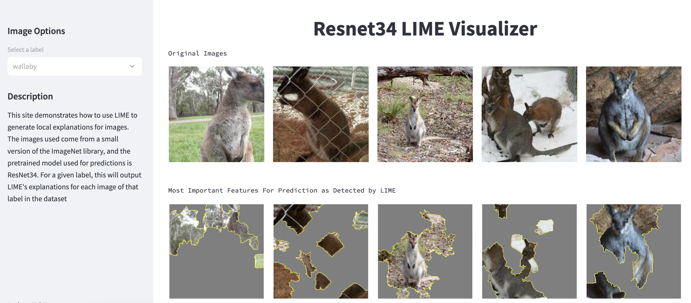

# Explainable AI Techniques
Generating Local Explanations on a Pretrained Black-Box Model

### Introduction
This notebook demonstrates how to use LIME to generate local explanations for images. The images used come from a small version of the ImageNet library, and the pretrained model used for predictions is ResNet34. For a given label, this will output LIME's explanations for each image of that label in the dataset. 

### WebApp Example Image:


### To Run The WebApp Yourself
If you would like to run the webapp that was created alongside this notebook:
#### 1. Open the terminal and cd into the root of this directory
#### 2. Run the following command:
```
streamlit run webapp/streamlit_app.py
```
#### 3. To close the connection exit out of the site and type control+C in the terminal

## Discussion
LIME (local interpretable model-agnostic explanations) was chosen because LIME works with image data (which is the data chosen for this project) and the explanations generated by the model are intuitive to understand. LIME works by selecting an instance of interest (in our case an image), perturbing the data and getting the black-box model predictions, generating a new dataset with the perturbed images and predictions, trains an interpretable model (such as a linear regression) to approximate predictions around the perturbed data, and uses the most influential features as an explanation for the original model’s prediction. Pros to LIME in general, but not necesarily for the case of this notebook, is that it is model agnostic meaning we could switch out Resnet34 and still use this explanable method. It also works with text and tabular data along with image data. Some limitations to LIME are that (especially for higher dimensional feature spaces) there isn't a robust method of finding the optimal kernel width for the exponential smoothing kernel used in its implementation. LIME explanations can also be inconsistent, LIME can be used to hide biases and it can be easily fooled.  

## Citations:

Lippe, Phillip, & Bent, Brinnae, PhD "Tutorial 10: Adversarial attacks." Github, 2024, https://github.com/AIPI-590-XAI/Duke-AI-XAI/blob/main/explainable-ml-example-notebooks/local_explanations.ipynb

[Shah, Shital](https://github.com/sytelus) "Tutorial - images - Pytorch." Github, 2019, https://github.com/marcotcr/lime/blob/master/doc/notebooks/Tutorial%20-%20images%20-%20Pytorch.ipynb
